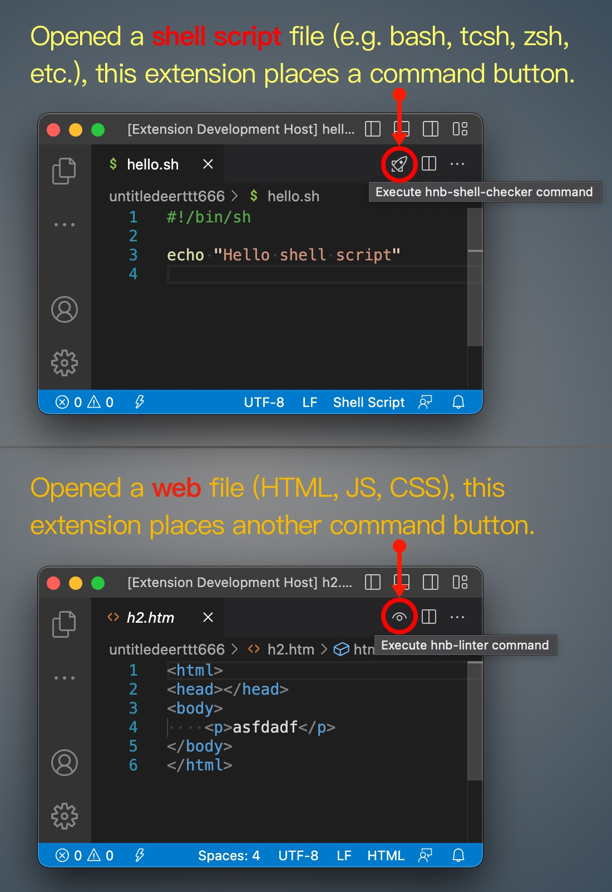

This extension ("customcommandbuttons") adds command buttons to the Editor toolbar area of VSCode.


## Requirements

Make sure the following terminal commands in your `PATH` environment.

```
$ which hnb-shell-checker
$ which hnb-linter
```


___
## For shell script file:

This extension places a *Rocket* command button when you opened a shell script file (e.g. bash, tcsh, zsh, etc.). If you click that button it will execute the following terminal command:

```
$ hnb-shell-checker "/path/to/current/opened/file"
```


## For web file (HTML, JS, CSS) file:

This extension places a *Eye* command button when you opened a web file (e.g. HTML, JavasSript, CSS). If you click that button it will execute the following terminal command:

```
$ hnb-linter "/path/to/cwd/dir" "/path/to/current/opened/file"
```

> cwd dir:
If you just open a separate file, cwd defaults to the user's home directory.
If you open a file in a workspace, cwd is the root directory of the workspace. 


___
## The Screenshots

